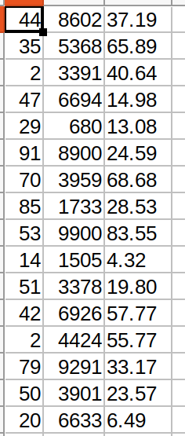

# 8 Clientes
0. [Que queremos obtener ](#schema0)
1. [Arrancar Zeppelin ](#schema1)
2. [Importación de librerías ](#schema2)
3. [Cargar ficheros ](#schema3)

4. [Crear función para procesar personas](#schema4)
6. [Conexión con SparkSQL](#schema6)
7. [Procesar la inforamción](#schema7)
8. [Convertir el RDD a dataset cacheado](#schema8)
9. [Uso de API en lugar del SQL Litera](#schema9)
10. [Filter](#schema10)
11. [GroupBy](#schema11)

# 0. Que queremos obtener

Vamos a buscar los clientes que mas han gastado. El formato del `.csv` es el siguiente.

# 1. Arrancar Zeppelin
Navegamos en la consola hasta llegar donde tenemos descargados la carpeta Zeppelin y ejecutamos:
~~~
bin/zeppelin-daemon.sh start
~~~

Seguidamente abrimos un página en el navegador y vamos a `http://localhost:8080`, se nos abre zeppelin y creamos un nuevo notebook, llamado Temperatura Sensor y como intérprete elegimos `spark2`

# 2. Importación de librerías

~~~scala
import org.apache.spark._
import org.apache.spark.SparkContext._
import org.apache.spark.sql._
import spark.implicits._
~~~

# 3. Cargar ficheros

~~~scala
val lineas = spark.sparkContext.textFile("file:///home/patricia/Documentos/scala/8-clientes/data/customers-orders.csv")
~~~

# 4. Crear función para procesar personas
Sólo vamos a utilizar los datos del Cliente y Precio
~~~scala
def extraerClientePrecio(linea:String) = {
    val campos = linea.split(",")
    (campos(0).toInt, campos(2).toFloat)
}
~~~