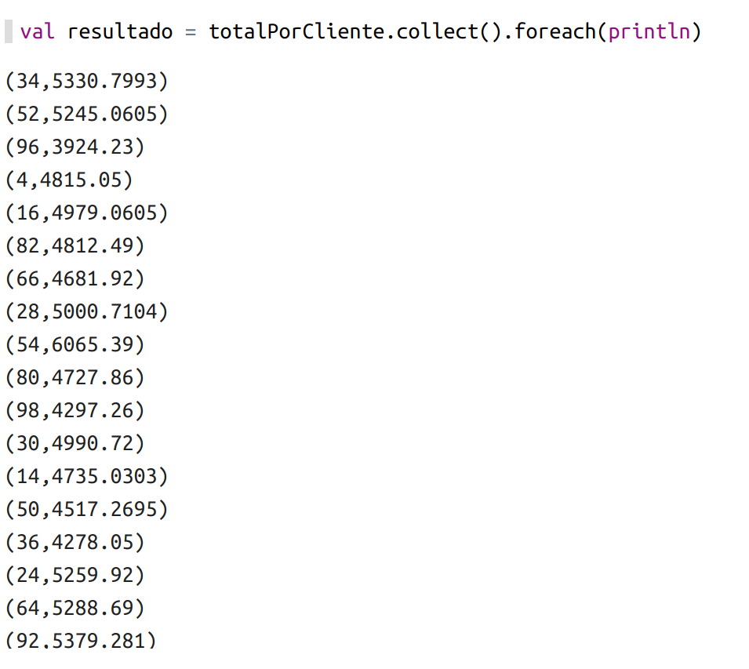
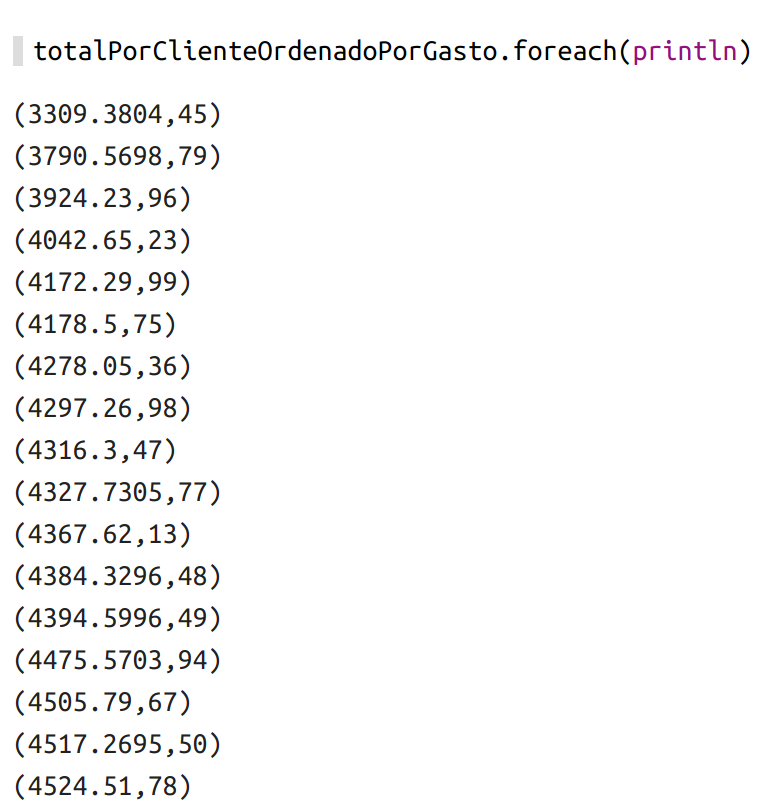
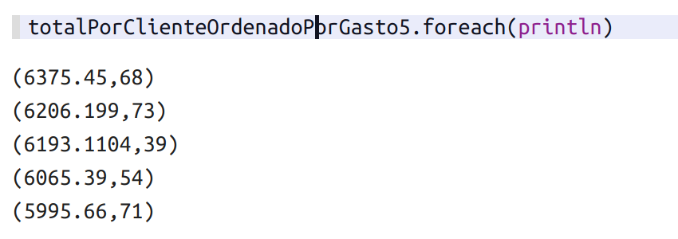

# 8 Clientes
0. [Que queremos obtener ](#schema0)
1. [Arrancar Zeppelin ](#schema1)
2. [Importación de librerías ](#schema2)
3. [Cargar ficheros ](#schema3)
4. [Crear función para procesar clientes](#schema4)
5. [Procesamos los datos](#schema5)
6. [Obtener los datos e imprimirlos](#schema6)
7. [Ordenar por el valor de los gastos](#schema7)

# 0. Que queremos obtener

Vamos a buscar los clientes que mas han gastado, el top de gastos en las cuentas. El formato del `.csv` es el siguiente.

# 1. Arrancar Zeppelin
Navegamos en la consola hasta llegar donde tenemos descargados la carpeta Zeppelin y ejecutamos:
~~~
bin/zeppelin-daemon.sh start
~~~

Seguidamente abrimos un página en el navegador y vamos a `http://localhost:8080`, se nos abre zeppelin y creamos un nuevo notebook, llamado Temperatura Sensor y como intérprete elegimos `spark2`

# 2. Importación de librerías

~~~scala
import org.apache.spark._
import org.apache.spark.SparkContext._
import org.apache.spark.sql._
import spark.implicits._
~~~

# 3. Cargar ficheros

~~~scala
val datosEntrada = spark.sparkContext.textFile("file:///home/patricia/Documentos/scala/8-clientes/data/customers-orders.csv")
~~~

# 4. Crear función para procesar clientes
Sólo vamos a utilizar los datos del Cliente y Precio
~~~scala
def extraerClientePrecio(linea:String) = {
    val campos = linea.split(",")
    (campos(0).toInt, campos(2).toFloat)
}
~~~

# 5. Procesamos los datos
~~~scala
val datosProcesados = datosEntrada.map(extraerClientePrecio)
~~~

# 6. Obtener los datos e imprimirlos
Hacemos un `reduceByKey` siendo la key el cliente.

~~~scala
val totalPorCliente = datosProcesados.reduceByKey((x,y)=>x + y)
val resultado = totalPorCliente.collect().foreach(println)
~~~

# 7. Ordenar por el valor de los gastos

Para otdenar tenemos `sortByKey` ordena por clave, cosa que nos nos vale porque ordenaríamos por el ID del cliente no por los valores de los gastos.

Entoces para poder usarlo vamos a tener que hacer una transformación
~~~scala
val totalPorClienteOrdenadoPorGasto = totalPorCliente.map(elemento => (elemento._2, elemento._1)).sortByKey(false).collect()
~~~
Con `false`dentro del sort no los dan el orden descendente.

Ahora vamos a obtener los 5 primeros con mas gastos, en vez de poner `collect()` ponemos `take(5)` que solo obtenemos los 5 primeros.
~~~scala
val totalPorClienteOrdenadoPorGasto5 = totalPorCliente.map(elemento => (elemento._2, elemento._1)).sortByKey(false).take(5)

totalPorClienteOrdenadoPorGasto5.foreach(println)
~~~
